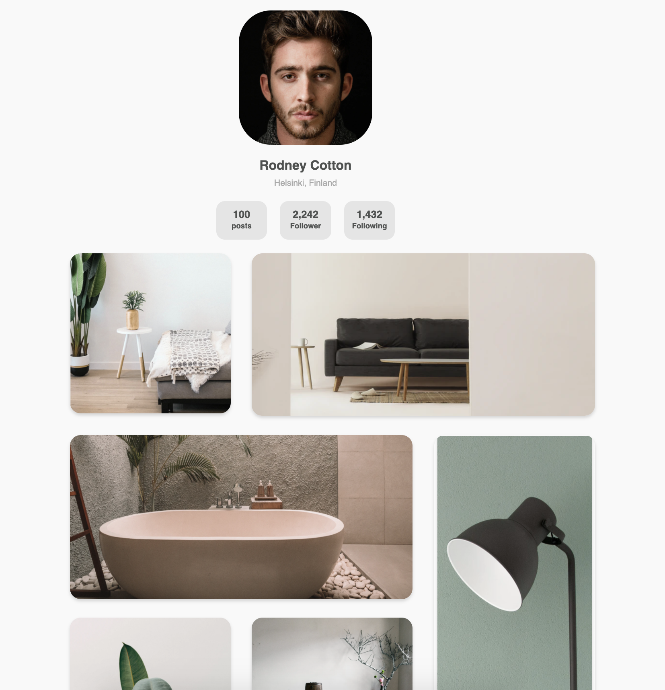
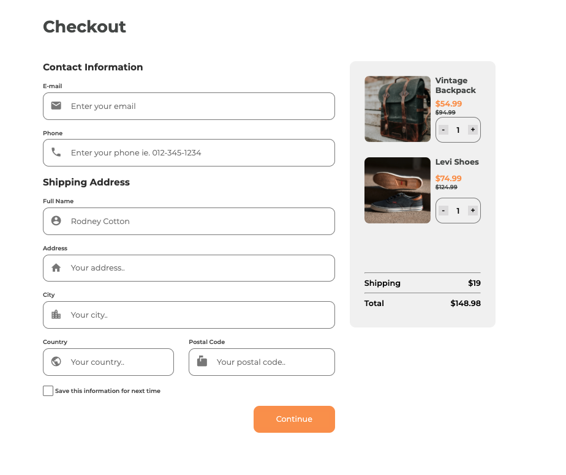

# Dev challenges  🌟

Challenges / Category ✍️  | Requirements 🎮 | Solutions 🚀 | Screenshots 📷
------------ | ------------- | ------------- | -------------
404 not found page / UI | Create a 404 not found page following the design. The page should be responsive. | https://404notfounddevchallenge.netlify.app | 
My Team page  / UI| Create my team page following the design. The page should be responsive. | https://myteampagedc.netlify.app | 
Interior Consultant / UI | Create a homepage following the design. The page should be responsive. | https://interiorconsultantdc.netlify.app | 
Recipe page / UI | Challenge: Create a recipe page following the given design. You can use your own recipe and remember to put the source. The page should be responsive. | https://recipeblogpagedc.netlify.app | 
Gallery page / UI | Challenge: Create a static page with HTML and CSS following the designs. You can give it your personal styles by using different images or text. | https://mygallerydc.netlify.app/ | 
Checkout Page / UI | Challenge: Create a checkout page following the design. You don’t need to use JS in this challenge but use correct input types and validation. | https://checkoutpagedc.netlify.app | 
Button Component / Front-end / Desing System | Challenge: Create a reusable button with all the states in the design and a page displaying all the states. You can work on the same project with other design system challenges. Use Front-end libraries like React or Vue. | https://buttoncomponentdc.netlify.app | 