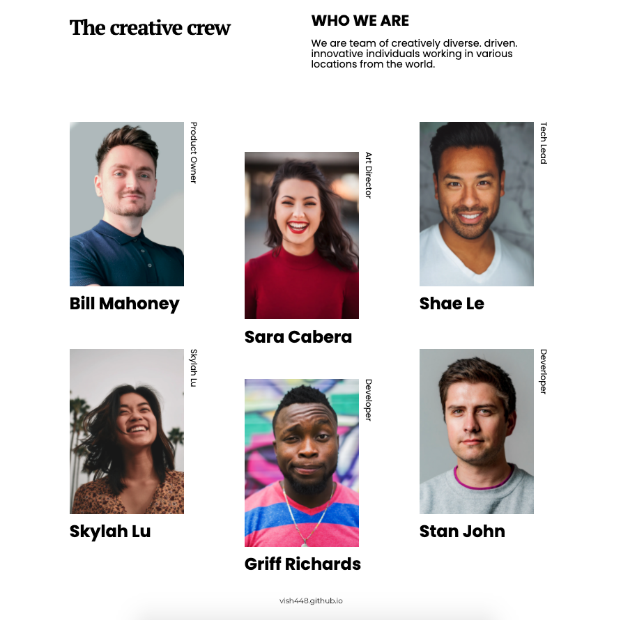
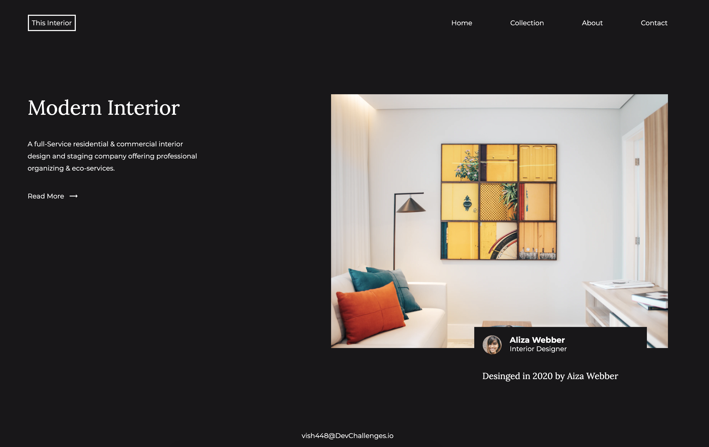
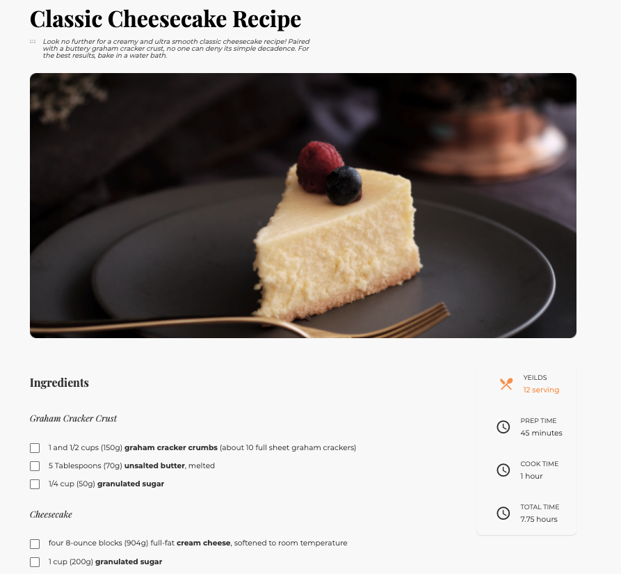

# Dev challenges  🌟

Challenges/Category ✍️  | Requirements 🎮 | Solutions 🚀 | Screenshots 📷
------------ | ------------- | ------------- | -------------
404 not found page / UI | Create a 404 not found page following the design. The page should be responsive. | https://404notfounddevchallenge.netlify.app | 
My Team page  / UI| Create my team page following the design. The page should be responsive. | https://myteampagedc.netlify.app | 
Interior Consultant / UI | Create a homepage following the design. The page should be responsive. | https://interiorconsultantdc.netlify.app | 
Recipe page /UI | Challenge: Create a recipe page following the given design. You can use your own recipe and remember to put the source. The page should be responsive. | recipeblogpagedc.netlify.app | 
